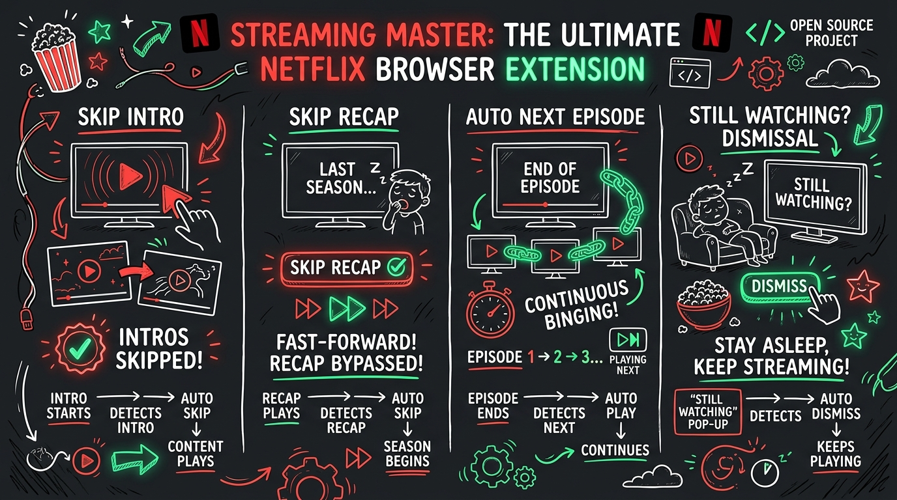

<div align="center">

# 🎬 Netflix Auto Skip

**A high-performance, zero-latency open-source browser extension that automates Netflix playback interactions — instantly skipping intros, recaps, post-play credits, and auto-dismissing 'Are you still watching?' interruptions.**

[](https://developer.chrome.com/docs/extensions/mv3/intro/)
[](LICENSE)
[](#-browser-installation)
[](#-privacy--security)

<br/>



</div>

---

## ⚡ Highlights

- ⏩ **Instant Intro Skip**: Auto-clicks "Skip Intro" within milliseconds of rendering.
- ⏪ **Auto Recap Skip**: Bypasses previous episode summaries and preplay recaps automatically.
- ⏭️ **Instant Next Episode**: Skips credit countdowns and transitions to the next episode seamlessly without waiting.
- ▶️ **Auto-Confirm "Still Watching"**: Automatically handles periodic playback pause prompts for uninterrupted binge-watching sessions.
- 🔔 **Subtle On-Screen HUD**: Elegant, non-intrusive on-screen notification badge on the Netflix player when an action occurs.
- 📊 **Real-time Analytics**: Built-in statistics counter tracking all skipped segments and time saved.
- 🎛️ **Modular Controls**: Enable or disable any automation individually via a dark-mode luxury popup interface.
- 🛡️ **Zero Tracking**: 100% local execution with no remote scripts, analytics, or external network requests.

---

## 📦 Instant Download & Release

Pre-built, production-ready packages are available in the [`dist/`](dist/) folder:
- **Direct Zip Download**: [`netflix-auto-skip-v1.0.0.zip`](dist/netflix-auto-skip-v1.0.0.zip)

---

## 🌐 Browser Installation

Built on the modern **Manifest V3** standard, this extension is compatible with all Chromium-based desktop browsers.

### 🔴 For Vivaldi Browser
1. Download and extract [`netflix-auto-skip-v1.0.0.zip`](dist/netflix-auto-skip-v1.0.0.zip) (or clone this repository).
2. Open **Vivaldi** and navigate to:
   ```text
   vivaldi://extensions
   ```
3. Enable **Developer mode** in the top-right corner.
4. Click **Load unpacked** in the top-left toolbar.
5. Select the extracted folder.
6. Open [Netflix](https://www.netflix.com) and enjoy seamless viewing!

---

### 🔵 For Google Chrome & Chromium
1. Open Chrome and navigate to `chrome://extensions`.
2. Enable **Developer mode** (toggle in the top-right).
3. Click **Load unpacked** and select the extension folder.

---

### 🟦 For Microsoft Edge
1. Open Edge and navigate to `edge://extensions`.
2. Turn on **Developer mode** in the left navigation menu.
3. Click **Load unpacked** and select the folder.

---

### 🦁 For Brave Browser
1. Open Brave and go to `brave://extensions`.
2. Enable **Developer mode** (top-right).
3. Click **Load unpacked** and choose the folder.

---

### 🔴 For Opera / Opera GX
1. Open Opera and visit `opera://extensions`.
2. Turn on **Developer mode** and click **Load unpacked**.

---

## 🏗️ Architecture & Engine Details

Netflix's modern player is a single-page application built on dynamic React streaming components. Standard extension scripts often run into race conditions or trigger issues. Netflix Auto Skip solves this using a multi-layer engine:

```
┌────────────────────────────────────────────────────────┐
│               Netflix Video Player DOM                 │
└──────────────────────────┬─────────────────────────────┘
                           │
                 [ MutationObserver ] (Batched with RAF)
                           │
       ┌───────────────────┴───────────────────┐
       ▼                                       ▼
[ Button Detection ]                   [ Video Progress Guard ]
- [data-uia="player-skip-intro"]       - Start Guard (< 2m): Blocks next ep
- [data-uia="player-skip-recap"]       - End Guard (> 80% / < 180s): Allows postplay
- [data-uia="next-episode-seamless"]   - Strict exclusion of bottom control bar
       │                                       │
       └───────────────────┬───────────────────┘
                           │ Validated
                           ▼
          [ Synthetic Event Dispatcher ]
          PointerDown → MouseDown → PointerUp → MouseUp → Click
                           │
                           ▼
          [ Action Execution & Toast HUD ]
```

1. **`MutationObserver` + RAF Batching**: Zero CPU overhead; catches DOM changes at 60fps without video stutter.
2. **Double-Layer Progress Guards**: Strictly prevents next-episode triggers during the opening segment of a video.
3. **Synthetic Event Dispatcher**: Dispatches full `PointerEvent` and `MouseEvent` sequences required by React's internal synthetic event system.
4. **Isolated HUD Styling**: Floating glassmorphism notifications insulated with high z-index and isolated CSS namespaces.

---

## 📂 Project Structure

```
Netflix Auto Skip/
├── manifest.json              # Manifest V3 extension configuration
├── LICENSE                    # MIT Open Source License
├── README.md                  # Comprehensive documentation and setup guide
├── CONTRIBUTING.md            # Guidelines for open-source contributors
├── CHROMEWEBSTORE.md          # Chrome Web Store submission metadata
├── assets/                    # Project visual assets & infographic
│   └── infographic.png
├── dist/                      # Production release packages
│   └── netflix-auto-skip-v1.0.0.zip
├── generate-icons.py          # Script for generating crisp high-res icons
├── icons/                     # Precision icons (16x16, 32x32, 48x48, 128x128)
│   ├── icon-16.png
│   ├── icon-32.png
│   ├── icon-48.png
│   └── icon-128.png
├── background/
│   └── service-worker.js     # Service worker (state synchronization & storage)
├── content/
│   ├── content.js            # Video player observer & synthetic click engine
│   └── content.css           # Glassmorphism on-screen HUD styling
└── popup/
    ├── popup.html            # Luxury dark-mode popup interface
    ├── popup.css             # Netflix Red glassmorphism styling
    └── popup.js              # Settings controller and live analytics
```

---

## 🔒 Privacy & Security

- **Strict Scoping**: Host permissions are limited solely to `*://*.netflix.com/*`.
- **Zero Data Collection**: No cookies, account information, browsing history, or viewing metrics are ever logged, sent, or shared.
- **Local Storage**: All preferences and skip statistics reside 100% locally on your machine via `chrome.storage`.

---

## 🤝 Contributing

Contributions, feature requests, and bug reports are welcome! Check out [CONTRIBUTING.md](CONTRIBUTING.md) to get involved.

---

## 📄 License

Distributed under the [MIT License](LICENSE).
