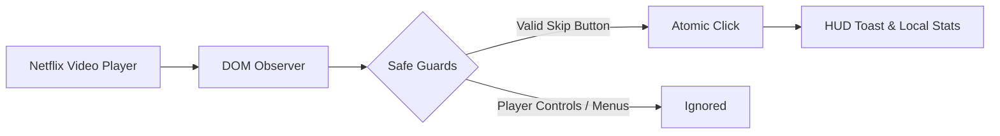

# 🎬 Netflix Auto Skip

**A lightweight, open-source browser extension that quietly removes Netflix playback interruptions.**

 

 

> *Install it, forget it, and let it quietly remove interruptions.*

---

## ✨ Features

- **Skip Intro** — Clicks "Skip Intro" as soon as it appears on screen.
- **Skip Recap** — Automatically bypasses previous episode summaries.
- **Next Episode** — Skips post-play credit countdowns to play the next episode immediately.
- **Auto-Confirm "Still Watching"** — Dismisses playback pause prompts during binge sessions.
- **On-Screen HUD Toast** — Sleek, subtle floating indicator when an action occurs (optional).
- **Customizable Toggles** — Turn individual automation features on or off anytime via the popup.
- **Local Stats Counter** — Tracks your total skips and time saved directly on your machine.

---

## 🚀 Quick Install (3 Steps)

1. **Download Release**: Grab [`netflix-auto-skip-v1.1.0.zip`](dist/netflix-auto-skip-v1.1.0.zip) from the [`dist/`](dist/) folder or [GitHub Releases](https://github.com/MPSMeridiaN/Netflix-Auto-Skip/releases).
2. **Extract ZIP**: Extract the archive to a folder on your computer.
3. **Load Extension**:
   - Open your browser's extension page (e.g. `chrome://extensions` or `vivaldi://extensions`).
   - Enable **Developer mode** (top-right toggle).
   - Click **Load unpacked** and select the extracted folder.

*Open [Netflix](https://www.netflix.com) and start watching!*

---

## 🌐 Browser Compatibility

Works with all modern Chromium-based desktop browsers:

| Browser | Support | Installation Path |
| :--- | :---: | :--- |
| **Google Chrome** | ✅ | `chrome://extensions` |
| **Vivaldi** | ✅ | `vivaldi://extensions` |
| **Microsoft Edge** | ✅ | `edge://extensions` |
| **Brave** | ✅ | `brave://extensions` |
| **Opera / Opera GX** | ✅ | `opera://extensions` |
| **Arc** | ✅ | `arc://extensions` |

---

## 🛠️ How It Works

- **Targeted Selectors**: Matches verified Netflix skip buttons while explicitly excluding player controls, audio/subtitle menus, and episode drawers.
- **Episode State Machine**: Tracks episode transitions so each skip action runs at most once per episode.
- **Low Overhead**: Scoped to active playback views (`/watch/*`) and throttled with `requestAnimationFrame`.

*For detailed architectural specifications, state machine transitions, and design diagrams, see [docs/ARCHITECTURE.md](docs/ARCHITECTURE.md).*

---

## 🔒 Privacy & Security

- **100% Offline**: Zero external network requests, zero telemetry, and zero analytics.
- **Scoped Permission**: Operates strictly on `*://*.netflix.com/*`.
- **Transparent Storage**:
  - User toggle settings sync across your own logged-in browser profile via `chrome.storage.sync` (with local fallback).
  - Skip counts stay strictly on your local device in `chrome.storage.local`.
- **No Account Access**: The extension cannot read your passwords, cookies, or payment details.

---

## 📄 License

Distributed under the [MIT License](LICENSE).

