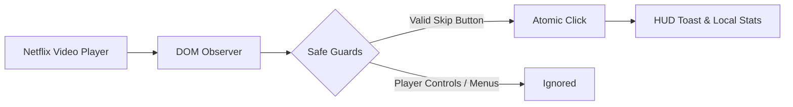

<div align="center">

# 🎬 Netflix Auto Skip

**A lightweight, open-source browser extension that quietly removes Netflix playback interruptions.**

[](https://developer.chrome.com/docs/extensions/mv3/intro/)
[](LICENSE)
[](#-browser-compatibility)
[](#-privacy--security)
[](https://github.com/MPSMeridiaN/Netflix-Auto-Skip/actions/workflows/ci.yml)
[](https://github.com/MPSMeridiaN/Netflix-Auto-Skip/releases)

<br/>


<br/>

> *Install it, forget it, and let it quietly remove interruptions.*

</div>

---

## ✨ Features

- **Skip Intro** — Clicks "Skip Intro" as soon as it appears on screen.
- **Skip Recap** — Automatically bypasses previous episode summaries.
- **Next Episode** — Skips post-play credit countdowns to play the next episode immediately.
- **Auto-Confirm "Still Watching"** — Dismisses playback pause prompts during binge sessions.
- **On-Screen HUD Toast** — Sleek, subtle floating indicator when an action occurs (optional).
- **Customizable Toggles** — Turn individual automation features on or off anytime via the popup.
- **Local Skip Counters** — Tracks skip counts directly on your machine.

---

## 🚀 Quick Install (3 Steps)

1. **Download Release**: Grab [`netflix-auto-skip-v1.1.1.zip`](dist/netflix-auto-skip-v1.1.1.zip) from the [`dist/`](dist/) folder or [GitHub Releases](https://github.com/MPSMeridiaN/Netflix-Auto-Skip/releases).
2. **Extract ZIP**: Extract the archive to a folder on your computer.
3. **Load Extension**:
   - Open your browser's extension page (e.g. `chrome://extensions` or `vivaldi://extensions`).
   - Enable **Developer mode** (top-right toggle).
   - Click **Load unpacked** and select the extracted folder.

*Open [Netflix](https://www.netflix.com) and start watching!*

---

## 🌐 Browser Compatibility

Designed for Chromium-based desktop browsers with Manifest V3 support. Netflix DOM changes can affect selector compatibility:

| Browser | Support | Installation Path |
| :--- | :---: | :--- |
| **Google Chrome** | ✅ | `chrome://extensions` |
| **Vivaldi** | ✅ | `vivaldi://extensions` |
| **Microsoft Edge** | ✅ | `edge://extensions` |
| **Brave** | ✅ | `brave://extensions` |
| **Opera / Opera GX** | ✅ | `opera://extensions` |
| **Arc** | ✅ | `arc://extensions` |

---

## 🛠️ How It Works



- **Targeted Selectors**: Matches verified Netflix skip buttons while explicitly excluding player controls, audio/subtitle menus, and episode drawers.
- **Episode State Machine**: Uses the canonical watch-route identity, so transient title DOM changes do not reset one-shot actions.
- **Low Overhead**: The playback observer and 1-second fallback poll exist only while a recognized player-root video is active; mutation scans are batched with `requestAnimationFrame`.

*For detailed architectural specifications, state machine transitions, and design diagrams, see [docs/ARCHITECTURE.md](docs/ARCHITECTURE.md).*

---

## 🧪 Development & Releases

This repository has no runtime dependencies. Run the complete local verification pipeline with:

```bash
npm run build
```

That command validates JavaScript syntax, runs production-code QA, checks release metadata, builds the deterministic ZIP, and verifies its contents.

Releases are tag-driven. To prepare the next version and synchronize the manifest, popup, documentation, and changelog surfaces:

```bash
npm run release:prepare -- 1.1.2
```

Review and complete the generated version section in [`CHANGELOG.md`](CHANGELOG.md), then commit and push the matching tag (`v1.1.2`). GitHub Actions verifies the tag, runs the same build pipeline, attaches the ZIP, and publishes the release notes automatically.

See [`CONTRIBUTING.md`](CONTRIBUTING.md) for change guidelines and [`SECURITY.md`](SECURITY.md) for private vulnerability reporting.

---

## 🔒 Privacy & Security

- **No telemetry or network backend**: No telemetry, analytics, remote backend, or extension-initiated external network requests.
- **Scoped Permission**: Operates only on `https://www.netflix.com/*` and requests the `storage` permission.
- **Transparent Storage**:
  - User toggle settings sync across your own logged-in browser profile via `chrome.storage.sync` (with local fallback).
  - Skip counts stay strictly on your local device in `chrome.storage.local`.
- **Playback-only behavior**: The content script inspects the Netflix playback-page DOM for supported controls. It does not intentionally collect or transmit credentials, cookies, payment details, or account data.

---

## 📄 License

Distributed under the [MIT License](LICENSE).
