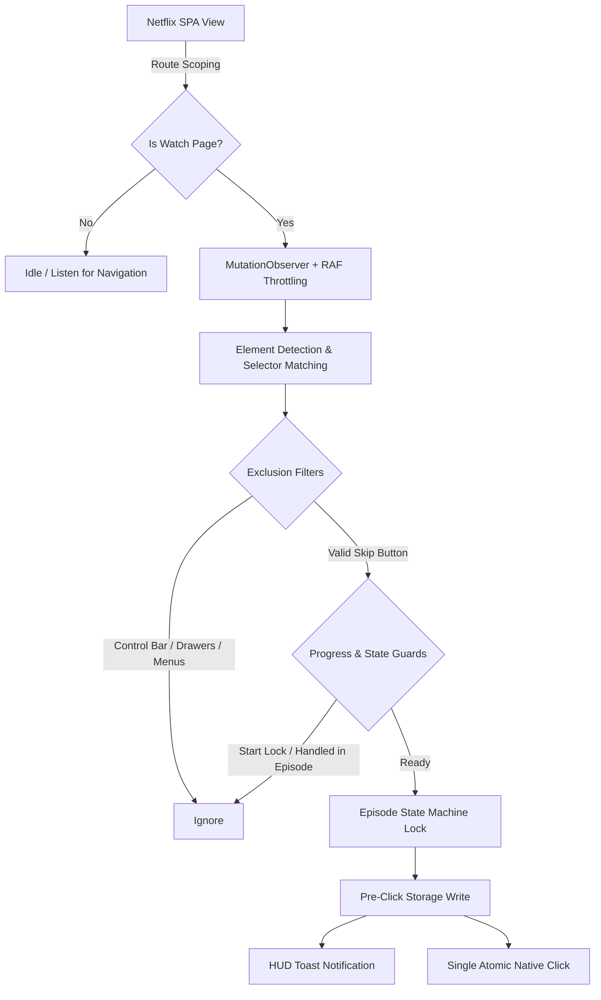

# Architecture & Technical Design

Technical documentation for the **Netflix Auto Skip** browser extension engine.

---

## High-Level System Overview

---

## Core Components

### 1. Scoped Execution & DOM Observation (`content/content.js`)
- **Route Filtering**: Active scanning only executes on playback routes (`/watch/*`) or when an active `<video>` element is present in the DOM. Catalog browsing (`/browse`) remains in an ultra-low overhead listening state.
- **Batched Mutation Observer**: Listens for dynamic player UI insertions (`class`, `data-uia`, `style`) and batches evaluation with `requestAnimationFrame` to prevent playback frame drops.
- **Heartbeat Polling**: A lightweight 1000ms heartbeat acts as a secondary failsafe.

### 2. Multi-Layer False-Positive Prevention
The extension employs strict exclusion guards before evaluating any click candidate:
1. **Control Bar Guard**: Disregards all standard bottom playback buttons (`control-next`, `control-play-pause`, `control-fullscreen-enter`, `.watch-video--bottom-controls-container`).
2. **Drawer & Menu Guard**: Disregards episode lists, season selectors, audio/subtitle menus, and setting flyouts (`.episode-list`, `[data-uia*="episodes-"]`, `.audio-subtitle-controller`).
3. **Non-Action Postplay Guard**: Explicitly ignores non-skip buttons such as "Watch Credits" or "Back to Browse".
4. **Playback Boundary Guard**:
   - **Credits / Next Episode**: Locked during early playback (`currentTime < 45s`). Only active when playback is near the end (`progress >= 0.75` or `remaining <= 150s`) or inside genuine postplay containers.
   - **Intro / Recap**: Locked during the second half of the episode (`progress > 0.60`).

### 3. Episode Lifecycle State Machine
Netflix is a Single-Page Application (SPA) where playback transitions between episodes without full document reloads.

- **Identity Tracking**: Key constructed from `Watch ID` and episode title.
- **One-Shot Locks**: Actions (`intro`, `recap`, `credits`) are executed at most once per episode key.
- **Prompt Cooldown**: "Still Watching" interruption prompts use a time-based cooldown (4000ms) rather than a permanent per-episode lock, ensuring binge sessions continue smoothly.
- **SPA Navigation Listener**: Intercepts `history.pushState`, `history.replaceState`, and `popstate` to immediately reset handled locks upon episode change.

### 4. Storage & State Isolation
- **User Preferences**: Synced via `chrome.storage.sync` with automatic fallback to `chrome.storage.local`.
- **Skip Statistics**: Kept strictly in `chrome.storage.local` to prevent sync quota issues, network thrashing, and cross-device race conditions.
- **Pre-Click Commit**: Statistics are saved before dispatching the click event to avoid data drops when Netflix unloads the current video view.
